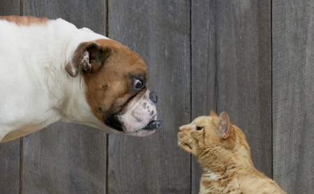

## KNN-Image-compression
OK so for Image Compression, I have used K-means Algorithm to compress image of a Cat and Dog.

but before Image Compression I have done KNN on a dataset[source: AndrewNg Course]

Number of Components `k=16` I have used meaning total number of colors in output image will be 16.

Original 

Compression with K=16 

Disclaimer: I guess my model is not best or I have used to much for loop. To compress this image `450x278 and 53.15KB` to `450x278 and 51.4KB` took me near about 20 mins.
Thank you If you can help me with this issue.
